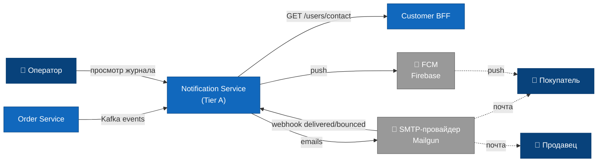

## 1. Контекст / модуль

**Сервис: «Notification»**

На Tier A термин «Bounded Context» избыточен — Notification это не отдельная предметная область, это техническая прокладка между Kafka и провайдерами доставки. Поэтому здесь — просто описание модуля.

### Отвечает за

- Подписку на доменные события Order Service (`OrderConfirmed`, `OrderPaid`, `OrderShipped`, `OrderDelivered`, `OrderCancelled`, `OrderRefunded`, `DisputeOpened`, `DisputeResolved`).
- Выбор каналов доставки по типу события (фиксированная таблица в коде).
- Загрузку шаблона из БД, подстановку переменных, отправку через SMTP-провайдер и Firebase Cloud Messaging.
- Журналирование каждой попытки отправки: статус, ошибка, время.
- Ретраи при временных ошибках провайдера (3 попытки с экспоненциальной задержкой).
- Приём webhook'ов от SMTP-провайдера про `delivered` / `bounced`.
- Админский UI: фильтрация журнала, ручной retry «упавших», просмотр исходного события.

### Не отвечает за

- Бизнес-логику маркетплейса. Любые правила вида «отправляй СМС если сумма > 100к» **не здесь**, а в источнике события.
- Хранение настроек подписок пользователя. Tier A не делает «отписку от рассылки» — это расширение для Tier B.
- A/B-тесты текстов писем — отдельная история, не входит в первый запуск.
- Кампании / массовые рассылки. Notification отправляет **транзакционные** уведомления, привязанные к событию.
- Push-сертификаты Apple/Android и токены устройств — берёт у Customer BFF через REST.
- Хранение тела письма после отправки (только метаданные: кому, когда, статус).

### Соседние системы

Все связи — асинхронные, кроме одной (REST в Customer BFF за токенами и email).

| Сосед | Направление | Как |
|---|---|---|
| Order Service | inbound | подписка на топик `marketplace.orders.v1` (Kafka) |
| Customer BFF | outbound REST | `GET /api/v1/users/{id}/contact` — email + push-токены пользователя |
| SMTP-провайдер (Mailgun) | outbound + inbound webhook | `POST /messages` для отправки; webhook `/notifications/email-events` для bounce/delivered |
| Firebase Cloud Messaging | outbound | `POST /fcm/send` — fire-and-forget, без webhook |
| Admin UI / оператор | inbound REST | `GET /api/v1/notifications` (фильтрация), `POST /retry` |

### Стейкхолдеры

- **Владелец**: команда «Платформа» (Platform team) — Notification считается инфраструктурным сервисом.
- **Зависят от нас**: Customer BFF (показывает inbox), оператор поддержки (читает журнал доставок при разборе жалоб).
- **От кого зависим**: Order Service (источник событий), Customer BFF (контакты), SMTP-провайдер, FCM.

### Диаграмма C1 — System Context

