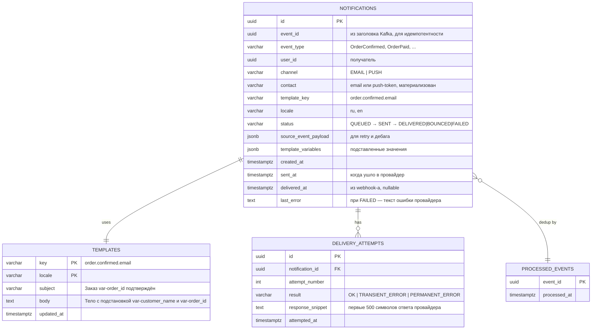

## 3. Domain Model

На Tier A раздел сводится к ER-схеме и списку таблиц. Никаких агрегатов, value objects, доменных событий — это **проектное** решение, не упущение.

### ER-схема

### Таблицы — словами

- **`notifications`** — главная таблица. Одна строка = одна попытка доставки на один канал. Хранит копию контакта на момент отправки (email мог поменяться) и копию шаблонных переменных (для retry без обращения к Customer BFF).
- **`templates`** — шаблоны письма. Ключ = `<event_type>.<channel>` (например `order.confirmed.email`). Язык — `locale`. Тело может содержать `${var}` — подстановка простой `String.replace`.
- **`delivery_attempts`** — лог каждой попытки отправки. Изолирован от `notifications` чтобы запросы по статусу шли по индексу без сканирования больших `jsonb`-полей.
- **`processed_events`** — журнал обработанных Kafka-событий для идемпотентности консьюмера. PK по `event_id` — повторная доставка от Kafka не создаст дубль уведомления.

### Что **НЕ делается**

- Tier A не вводит модели UseCase-входов (`SendNotificationRequest` и т.п.). Контроллер / сервис принимают сразу JSON-DTO. Это ОК для CRUD-сервиса.
- Нет агрегатов, value objects, доменных событий.
