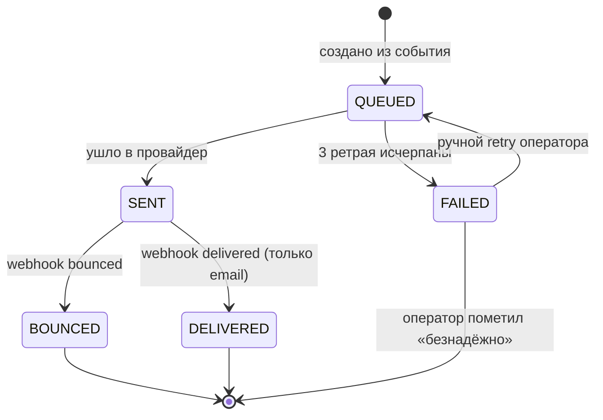

## 4. Жизненный цикл уведомления

Терминальные состояния: `DELIVERED`, `BOUNCED`, и `FAILED` после ручной отметки оператора.

### Замечания

- **PUSH-канал не имеет webhook'а** — статус автоматически становится `SENT` и остаётся таким; `DELIVERED`/`BOUNCED` для push не достижимы. Это нормальное ограничение FCM.
- **Между `QUEUED` и `SENT`** уведомление может несколько раз пройти через `delivery_attempts` с `result=TRANSIENT_ERROR`. Видимый статус остаётся `QUEUED` до первой удачной отправки.
- **Ручной retry** возможен только для `FAILED`. Из `BOUNCED` retry бесполезен — провайдер сказал «адрес недоставляем».
